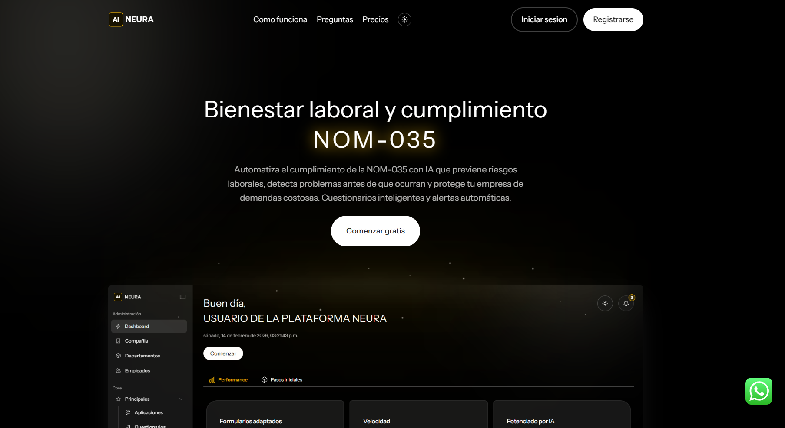

# Neura: NOM-035 Automation with Laravel 🚀

Neura is a TALL Stack platform designed to automate compliance with the Mexican Official Standard 035 (NOM-035) for workplace wellbeing, psychosocial risk prevention, and incident management.

---

## Conventions & Best Practices 🧠
- **Laravel Boost + AI:** Uses Laravel Boost to guide AI and keep code up-to-date.
- **Livewire Components:** Properties first (snake_case), then methods, render last. See `.ai/custom-conventions.md`.
- **Imports:** All `use ...` statements at the top of the file.
- **User Texts:** All user-facing text must use `__('text')` for translation.
- **Facades over helpers:** Prefer facades (`Auth::user()`) instead of helpers (`auth()->user()`).
- **CRUDDY Controllers:** All controllers follow CRUDDY by Design (only the 7 resourceful methods).
- **Actions Pattern:** Business logic is encapsulated in Action classes for clean and decoupled code.
- **Technical documentation:** Update README and AI instruction files after every relevant change.

---

## Main Tools & Technologies 🛠️

### TALL Stack Versions

| Technology     | Version     |
|---------------|-------------|
| Tailwind CSS  | 4.1.18      |
| Alpine.js     | (latest)    |
| Laravel       | 12.51.0     |
| Livewire      | 3.7.10      |

### Other Tools

- Laravel Boost v2.1.4
- Laravel Reverb v1.7.1
- Livewire Volt v1.10.2
- Livewire Flux v2.12.0
- phpstan v2.1.39
- Laravel Pint v1.27.1
- Queues: Jobs and workers for async tasks
- Tickets: System for reporting workplace incidents, including anonymous tickets
- Notifications: Automatic and real-time for HR and employees

---

## Main Features ⚡

- **NOM-035 Automation:** Smart questionnaires, automatic alerts, reports, and predictive analysis
- **Incident Tickets:** Reporting and tracking workplace incidents, HR dashboard
- **Real-time Notifications:** Push alerts, automatic emails, interactive dashboard
- **Predictive Analysis:** AI detects risks before they occur and prevents labor lawsuits

---

## Technical Project Structure 🗂️

- `.ai/guidelines/`: Custom conventions and guides for AI
- `app/Actions/`: Action classes for business logic
- `app/Livewire/`: Livewire components organized by module:
	- `Actions/`
	- `Alert/`
	- `Analysis/`
	- `Application/`
	- `Company/`
	- `Department/`
	- `Employee/`
	- `Forms/`
	- `Notifications/`
	- `Questionnaire/`
	- `Ticket/`
	- `Traits/`
- `resources/views/app/`: Main application views
- `resources/views/partials/`: Reusable Blade components
- `public/images/hero.png`: Main project image

---

**Neura** is the all-in-one solution for automated NOM-035 compliance, improving workplace wellbeing and risk management in Mexican companies. 🏢✨
